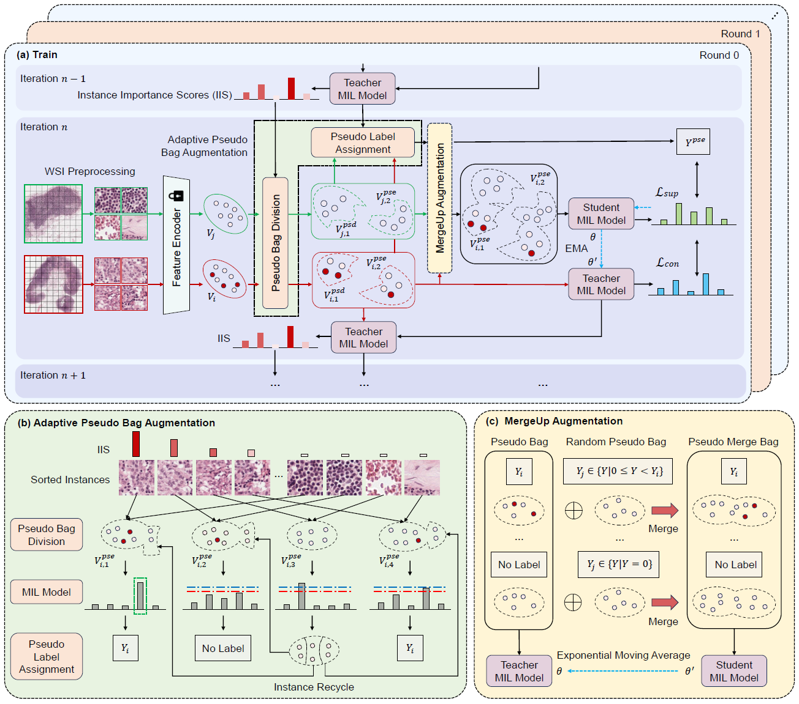

# SWS-MIL

<details>
<summary>
    <b>MergeUp Augmented Semi-weakly Supervised Learning for Whole Slide Image Classification</b>. 
</summary>
**Abstract:** Recent advancements in computational pathology and artificial intelligence have significantly improved whole slide image (WSI) classification. However, the gigapixel resolution of WSIs and the scarcity of manual annotations present substantial challenges. A prevalent strategy is to apply weakly supervised learning, where multiple instance learning (MIL) serves as a pivotal approach. Traditional MIL methods rely solely on neural networks to determine instance labels, often failing to extract comprehensive information from slide-level labels. To address this issue, we translate the WSI classification task from weakly supervised learning to semi-weakly supervised learning, termed SWS-MIL. Herein, adaptive pseudo bag augmentation (AdaPse) is employed to assign labeled and unlabeled data based on a threshold strategy, maximizing the utility of training data. Furthermore, we propose a feature augmentation technique, MergeUp, which merges bags with low priority bags to enhance inter-category information, thereby increasing training data diversity and improving model performance. Experimental results on the CAMELYON-16 and BRACS datasets demonstrate the superiority of our method over existing state-of-the-art approaches, affirming its efficacy in WSI classification.

</details>




---

## Data Preprocess

we follow the CLAM's WSI processing solution (https://github.com/mahmoodlab/CLAM)

The original data is available in [Home - Grand Challenge (grand-challenge.org)](https://camelyon16.grand-challenge.org/) and [ngdc.cncb.ac.cn/databasecommons/database/id/8351](https://ngdc.cncb.ac.cn/databasecommons/database/id/8351).

```bash
# WSI Segmentation and Patching
python create_patches_fp.py --source DATA_DIRECTORY --save_dir RESULTS_DIRECTORY --patch_size 256 --preset bwh_biopsy.csv --seg --patch --stitch

# Feature Extraction
CUDA_VISIBLE_DEVICES=0,1 python extract_features_fp.py --data_h5_dir DIR_TO_COORDS --data_slide_dir DATA_DIRECTORY --csv_path CSV_FILE_NAME --feat_dir FEATURES_DIRECTORY --batch_size 512 --slide_ext .svs
```

## Installation

```bash
# create and activate the conda environment
conda create -n swsmil python=3.9 -y
conda activate swsmil
# install pytorch
pip3 install torch torchvision torchaudio --index-url https://download.pytorch.org/whl/cu118
# install related package
pip install -r requirements.txt
```

### Train

```python
python main.py --ckpt_dir $ckpt_dir --csv_dir $csv_dir --ckpt_dir $ckpt_dir --feat_dir $feat_dir --ts_dir $ts_dir 
```

csv export and data partition reference (https://github.com/mahmoodlab/CLAM)


